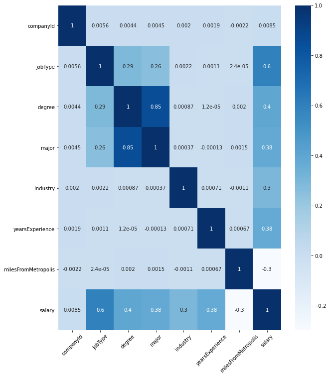

# Salary Prediction

### OBJECTIVE:
Predict salary based on job description.

### INTRODUCTION:
The project created a salary prediction model based on a job description. It used several machine learning models, including Linear Regression, Ridge Regression, Random Forest, and Gradient Boosting to train the data set; thereafter, the best model was selected based on the minimum of mean square error (MSE).

There are two Python files in this repository, including EDA_salary_prediction.ipynb and Salary Prediction Model_V0.1.ipynb.
The first one explored the data. The second one trained the models and identified the best model. The predictive models were trained by using two data set "Train features" and "Train salaries"
The testing data was used to predict the outcome based on the best model. 

Train features and Train salaries- This predictive model is trained using these 2 datasets consisting of 10 variables(including the target varibale) and 1 millon entries.
Test features- This dataset is used for predicting the model which is built.

The tools I used are Python and the libraries- numpy, pandas, matplotlib, seaborn and sklearn.

The model benefits both employers and employees. For the employers, the model can give them the baseline salary of a certain position with years of experience, and qualifications. So they can pay their employees up to the market and they may make a competitive offer to talented people. For the employees, the model can benefit them in making a decision when they have a job offer as well as maximum their salary by updating their skills and knowledge.

# Contents
### Define Problems
    Requirements
### Discover Data

### Develop Solutions

### Deploy Model

### DEFINE PROBLEMS
Requirements: Examining a set of job postings with salaries and then predict salaries for a new set of job postings.

### DISCOVER DATA
#### Exploratory Data Analysis (EDA)
The dataset contains both numeric and catergorical varibles.
###### Numeric variables:
    - yearsExperience: work experience in years
    - milesFromMetropolis: The distance from company's location to the CBD.
    - Salary: Target variable
###### Categorical variables:
    - jobType: Type of jobs, for example: CEO,CTO and manager.
    - major: Specific concentration
    - degree: Educational qualification. eg. High school, masters
    - industry: The industry where the company is specilized in.
###### Data Visualisation!

The Figure below shows the distribution of the target variable:

###### Correlation matrix
Correlations between selected features and response:

### Develop Solutions
Five machine learning models, namely the Linear Regression, Ridge Regression, Random Forest, and Gradient Boosting were used to train the data set.

####Model:
 - LinearRegression()
 - Average MSE:
 384.45106930859174
Standard deviation during CV:
 0.21378145979014107

Model:
 Pipeline
Average MSE:
 384.45457710309665
Standard deviation during CV:
 0.21053717230668667

Model:
 RandomForestRegressor
Average MSE:
 367.73726817189595
Standard deviation during CV:
 0.04361635931493879

Model:
 GradientBoostingRegressor
Average MSE:
 357.2948148118264
Standard deviation during CV:
 0.31321887136206783

### Deploy Model
 By using the minimum of mean square error (MSE) the best model that was selected was GradientBoostingRegressor(max_depth=5, n_estimators=150).
 Then, the feature importance was checked.
 
 
 
The selected model was used to predict the salaries.

